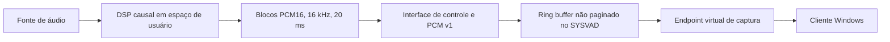

# Protótipo de redução de ruído local para voz humana no Windows

Protótipo acadêmico integrado para comparar algoritmos de redução de ruído,
processar áudio causalmente por blocos e alimentar um endpoint virtual de
captura no Windows.

**Estado em 14 de junho de 2026:** o RNNoise foi aprovado como candidato
principal em avaliação perceptual pré-ponte. O DSP, o transporte PCM e o
microfone virtual foram validados separadamente. A continuidade temporal
ponta a ponta não foi comprovada no VirtualBox/NEM; portanto, este repositório
não apresenta o sistema como produto pronto nem como solução de baixa latência
física comprovada.

## Resultado principal

- benchmark público e reproduzível com STFT, Wavelet, WPT, OM-LSA/IMCRA,
  RNNoise, WebRTC APM NS e DeepFilterNet3;
- RNNoise escolhido por escuta cega pré-ponte, com OM-LSA/IMCRA como reserva;
- processamento RNNoise persistente validado no host e na VM;
- transporte host-convidado validado com 1.000 blocos por perna, sem erro de
  sequência, CRC, enquadramento ou perda;
- ponte PCM v1, driver SYSVAD modificado e endpoint virtual funcional;
- contrafactual SYSVAD versus HDA compatível com limitação global do
  VirtualBox/NEM, sem provar correção do driver.

## Arquitetura



O laboratório separa três perguntas:

1. **Qualidade do DSP:** avaliada com corpus público, métricas pareadas e
   escuta controlada.
2. **Integração funcional:** avaliada por framing, hashes, contadores, IOCTLs,
   transporte e captura de sinal sintético.
3. **Continuidade temporal:** bloqueada na VM e reservada para validação futura
   em Windows nativo.

## Demonstração acadêmica

A demonstração recomendada possui três camadas independentes:

1. comparação A/B entre fala ruidosa e fala tratada pelo RNNoise;
2. sinal sintético conhecido alimentando o SYSVAD e capturado por um cliente;
3. logs, hashes e contadores que comprovam processamento, transporte e escrita
   no driver.

Não se usa uma captura longa da VM como prova de tempo real ponta a ponta. Veja
[docs/demonstracao_academica.md](docs/demonstracao_academica.md).

### Testar o RNNoise com qualquer WAV

```powershell
.\scripts\native\Build-RNNoiseAdapter.ps1
python -m realtime_audio.process_wav_rnnoise `
  --input caminho\audio_ruidoso.wav `
  --output resultados\demo_rnnoise\audio_tratado.wav
```

A CLI aceita WAV mono ou estéreo, converte para 16 kHz, processa blocos causais
de 20 ms e grava um JSON de métricas. No exemplo local
`resultados/audio/exemplo_noisy.wav`, comparado à referência
`resultados/audio/exemplo_clean.wav`, a melhoria de SNR foi de 5,02 dB
(2,31 dB para 7,33 dB), com RTF total 0,020 e zero blocos acima de 20 ms.
Os arquivos de áudio são artefatos locais ignorados pelo Git.

## Reproduzir

Instale as dependências:

```powershell
python -m pip install -r requirements.txt
```

Execute os testes e a verificação sintética:

```powershell
python -m pytest -q
python -m compileall benchmark_audio realtime_audio scripts tests
python -m realtime_audio.windows_realtime --pc-demo self-test --duration 1
```

O benchmark principal e os caminhos de literatura estão documentados em
[README_benchmark.md](README_benchmark.md). A pasta
[`resultados/publicaveis`](resultados/publicaveis) contém somente resumos leves,
hashes e métricas consolidadas.

## Documentação

- [Relatório final em PDF](entrega3.pdf)
- [Apresentação de fechamento em PDF](apresentacao_fechamento.pdf)
- [Estado atual](docs/estado_projeto.md)
- [Arquitetura do microfone virtual](docs/virtual_mic_architecture.md)
- [Demonstração acadêmica](docs/demonstracao_academica.md)
- [Validação futura em Windows nativo](docs/validacao_windows_nativo.md)
- [Migração da VM para Windows nativo](docs/migracao_windows_nativo.md)
- [Auditoria de publicação](docs/auditoria_publicacao.md)
- [Auditoria dos resultados](docs/auditoria_resultados.md)
- [Histórico de checkpoints](docs/checkpoints.md)

## Privacidade e licenças

Áudio privado, datasets, binários de terceiros, modelos, pacotes de driver,
credenciais, dumps e resultados volumosos não são publicados. O código de
adaptação registra a procedência e a licença dos sistemas externos, mas suas
fontes e binários devem ser obtidos nos projetos oficiais. Consulte
[THIRD_PARTY_NOTICES.md](THIRD_PARTY_NOTICES.md).

O repositório não possui licença geral de redistribuição. A publicação do
código-fonte não concede, por si só, permissão para reutilização fora dos
limites legais aplicáveis.
